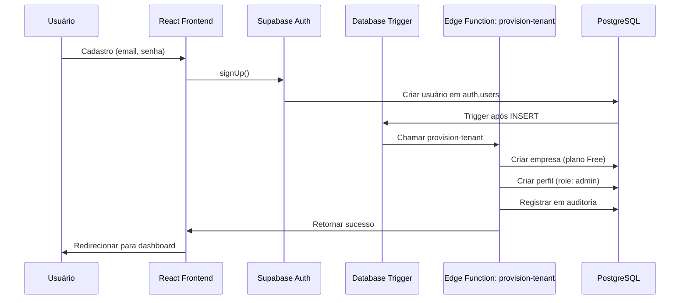
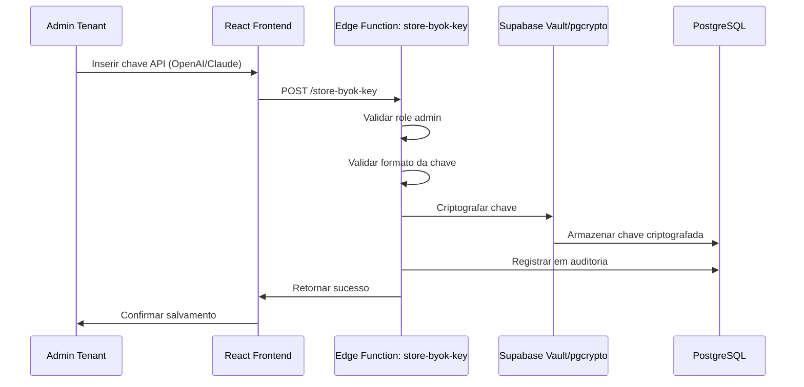
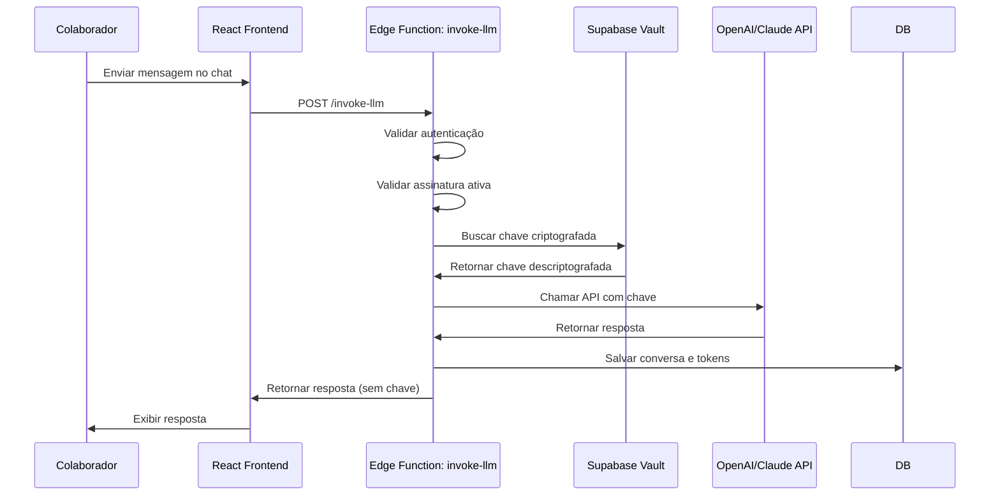
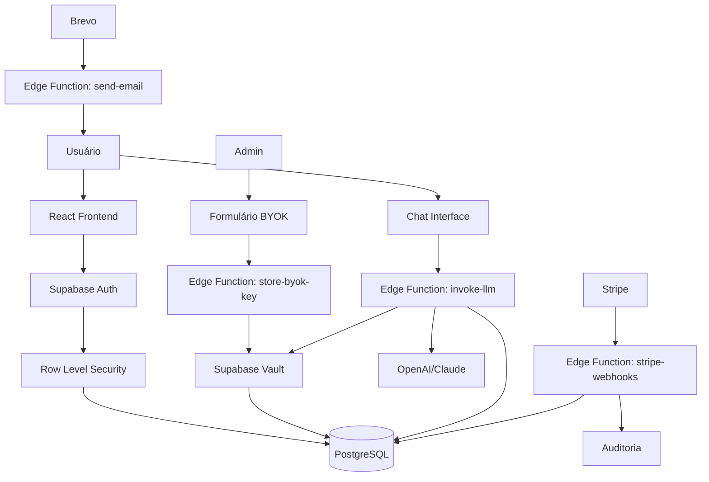

# Arquitetura do ControlAI

Este documento descreve a arquitetura técnica do projeto ControlAI, incluindo fluxos de dados, padrões de segurança e decisões arquiteturais.

## Visão Geral

O ControlAI é uma plataforma SaaS multi-tenant construída com:
- **Frontend:** React + Vite + TypeScript
- **Backend:** Supabase (PostgreSQL + Edge Functions)
- **Autenticação:** Supabase Auth
- **Pagamentos:** Stripe
- **E-mails:** Brevo
- **IA/LLM:** OpenAI/Claude (via BYOK)

## Arquitetura Multi-tenant

### Princípios Fundamentais

1. **Isolamento Total de Dados:** Cada empresa (tenant) só pode acessar seus próprios dados
2. **Row-Level Security (RLS):** Todas as tabelas com `empresa_id` têm políticas RLS ativas
3. **Provisionamento Automático:** Novos tenants são criados automaticamente no cadastro
4. **Segregação por Role:** Diferentes níveis de acesso (master, admin, user)

### Fluxo de Provisionamento de Tenant



### Estrutura de Dados Multi-tenant

Todas as tabelas principais têm `empresa_id` como chave estrangeira:

- `empresas` - Tabela raiz dos tenants
- `perfis` - Usuários vinculados a empresas
- `agentes_ia` - Agentes por empresa
- `conversas` - Histórico de conversas por empresa
- `uso_recursos` - Uso de recursos por empresa
- `auditoria` - Logs de ações por empresa

## Row-Level Security (RLS)

### Políticas RLS por Tabela

#### empresas
- **SELECT:** Usuário deve ter perfil vinculado à empresa
- **UPDATE:** Apenas role `admin` ou `master` da própria empresa
- **INSERT:** Apenas via Edge Function (service_role)

#### perfis
- **SELECT:** Usuário pode ver perfis da própria empresa
- **UPDATE:** Usuário pode atualizar próprio perfil; admin pode atualizar qualquer perfil da empresa
- **INSERT:** Apenas via Edge Function

#### agentes_ia
- **SELECT:** Usuários da empresa podem ver agentes ativos
- **INSERT/UPDATE/DELETE:** Apenas role `admin` da empresa

#### conversas
- **SELECT:** Usuário pode ver próprias conversas; admin pode ver todas da empresa
- **INSERT:** Usuário pode criar conversas na própria empresa
- **UPDATE:** Usuário pode atualizar próprias conversas

#### uso_recursos
- **SELECT:** Usuários podem ver uso da própria empresa
- **INSERT/UPDATE:** Apenas via Edge Functions

#### auditoria
- **SELECT:** Admin pode ver auditoria da própria empresa; master pode ver todas
- **INSERT:** Apenas via Edge Functions

### Validação de Isolamento

Para garantir isolamento, sempre:
1. Verificar `empresa_id` do usuário autenticado
2. Filtrar queries por `empresa_id`
3. Validar no backend (Edge Functions) antes de operações sensíveis

## Modelo BYOK (Bring Your Own Key)

### Fluxo de Armazenamento de Chave



### Segurança de Chaves

1. **Nunca armazenar em texto plano:** Sempre criptografar usando Supabase Vault ou pgcrypto
2. **Nunca expor ao cliente:** Chaves descriptografadas apenas server-side
3. **Logs mascarados:** Apenas últimos 4 caracteres em logs
4. **Validação de formato:** Validar formato da chave antes de salvar

### Fluxo de Uso da Chave



## Integração Stripe

### Fluxo de Assinatura

1. **Checkout:** Admin clica em "Assinar" → Edge Function cria sessão Stripe Checkout
2. **Pagamento:** Usuário completa pagamento no Stripe
3. **Webhook:** Stripe envia evento `checkout.session.completed`
4. **Processamento:** Edge Function `stripe-webhooks` atualiza `empresas.plano_id`
5. **Ativação:** Sistema libera acesso baseado no plano

### Eventos Stripe Tratados

- `checkout.session.completed` → Criar/atualizar `stripe_customer_id`
- `customer.subscription.created` → Atualizar `plano_id` e `proxima_cobranca`
- `customer.subscription.updated` → Atualizar `plano_id` se mudou
- `customer.subscription.deleted` → Rebaixar para plano Free
- `invoice.payment_succeeded` → Atualizar `proxima_cobranca`
- `invoice.payment_failed` → Notificar admin

### Validação de Assinatura

- Frontend: `SubscriptionGuard` verifica status antes de renderizar rotas protegidas
- Backend: Edge Functions validam assinatura ativa antes de operações sensíveis
- Limites: Sistema valida limites do plano antes de permitir ações

## Edge Functions

### Quando Usar Edge Functions

Use Edge Functions para:
- Operações que requerem `service_role` (bypass RLS)
- Lógica sensível que não deve rodar no cliente
- Integrações com APIs externas (Stripe, Brevo, LLM)
- Validações críticas de segurança
- Processamento de webhooks

### Estrutura de Edge Functions

```
supabase/functions/
├── _shared/              # Código compartilhado
│   ├── types.ts          # Tipos TypeScript
│   ├── supabase-admin.ts # Cliente admin
│   ├── validation.ts     # Schemas Zod
│   └── deno.json         # Configuração Deno
├── provision-tenant/     # Provisionar tenant
├── store-byok-key/      # Armazenar chave BYOK
├── invoke-llm/          # Chamar API LLM
├── stripe-webhooks/     # Processar webhooks Stripe
└── ...
```

### Padrão de Resposta

Todas as Edge Functions devem retornar:

```typescript
interface EdgeFunctionResponse<T> {
  success: boolean;
  data?: T;
  error?: string;
  message?: string;
}
```

### Tratamento de Erros

- Sempre validar entrada com Zod
- Retornar erros formatados (não stack traces)
- Registrar erros críticos em `auditoria`
- Nunca expor informações sensíveis em erros

## Estrutura de Diretórios

```
src/
├── components/          # Componentes React
│   ├── ui/             # Componentes Shadcn UI
│   ├── auth/           # Componentes de autenticação
│   ├── tenant/          # Componentes de gestão tenant
│   └── chat/           # Componentes de chat
├── contexts/           # Context Providers
│   ├── auth-context.tsx
│   └── tenant-context.tsx
├── hooks/              # Custom hooks
│   ├── use-auth.ts
│   └── use-tenant.ts
├── lib/                # Lógica de baixo nível
│   ├── supabase/       # Cliente Supabase
│   └── api/            # Funções de API
├── pages/              # Páginas da aplicação
│   ├── auth/           # Login, Register
│   ├── dashboard/      # Dashboards
│   └── chat/           # Chat
└── routes/             # Configuração de rotas

supabase/
├── migrations/         # Migrations SQL
├── functions/         # Edge Functions
└── config.toml        # Configuração Supabase
```

## Convenções de Código

### Nomenclatura

- **Componentes:** PascalCase (`UserProfile.tsx`)
- **Funções:** camelCase (`getSupabaseClient()`)
- **Constantes:** UPPER_SNAKE_CASE (`MAX_RETRIES`)
- **Tipos/Interfaces:** PascalCase (`UserProfile`)
- **Arquivos:** kebab-case para diretórios, PascalCase para componentes

### TypeScript

- Sempre tipar funções e componentes
- Usar `interface` para objetos, `type` para uniões
- Evitar `any`, usar `unknown` quando necessário
- Validar dados de entrada com Zod

### React

- Componentes funcionais com hooks
- Usar `useState` para estado local
- Usar Context API para estado global
- React Query para cache de dados do servidor

### Segurança

- Nunca expor `service_role` no cliente
- Sempre validar entrada (frontend e backend)
- Usar RLS em todas as tabelas
- Criptografar dados sensíveis
- Rate limiting em endpoints críticos

## Fluxo de Dados Completo



## Decisões Arquiteturais

### Por que Supabase?

- RLS nativo para multi-tenancy
- Edge Functions serverless
- Auth integrado
- PostgreSQL robusto
- TypeScript support

### Por que Edge Functions?

- Segurança: código sensível nunca no cliente
- Performance: execução próxima ao banco
- Escalabilidade: serverless auto-scaling
- Integração: fácil integração com APIs externas

### Por que BYOK?

- Reduz custos operacionais
- Dá controle ao cliente sobre seus custos de LLM
- Permite usar diferentes provedores (OpenAI, Claude)
- Modelo de negócio SaaS mais sustentável

## Próximos Passos

1. Implementar políticas RLS (Épico 1)
2. Integrar Stripe (Épico 3)
3. Implementar armazenamento seguro de chaves (Épico 4)
4. Construir interface de chat (Épico 5)

## Referências

- [Documentação Supabase](https://supabase.com/docs)
- [Row-Level Security Guide](https://supabase.com/docs/guides/auth/row-level-security)
- [Edge Functions Guide](https://supabase.com/docs/guides/functions)
- [Stripe Webhooks](https://stripe.com/docs/webhooks)

